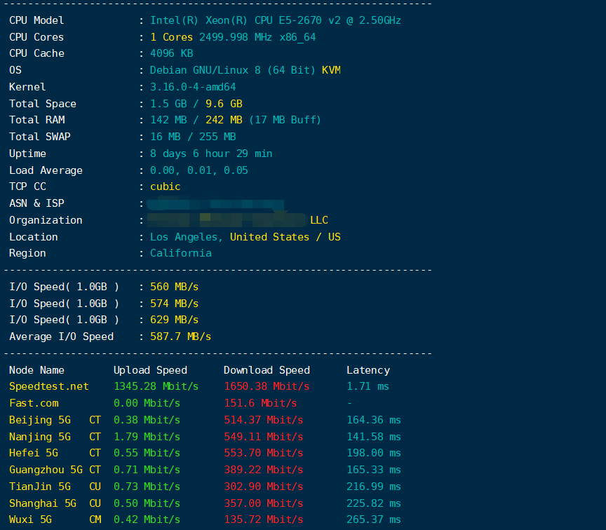
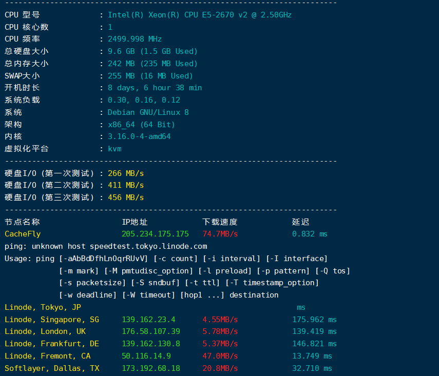
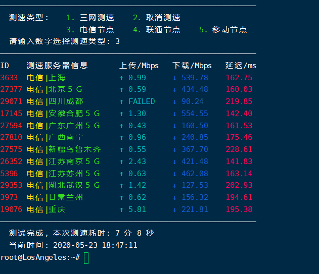

<h3>VPS性能测试1(显示ISP和地址)</h3>
    <pre>wget -qO- --no-check-certificate https://raw.githubusercontent.com/lklbjn/Pftest/master/superbench.sh | bash</pre>

<h3>VPS性能测试2(更多Ping)</h3>
中文版
    <pre>wget -N --no-check-certificate https://raw.githubusercontent.com/lklbjn/Pftest/master/Sbench-CN.sh && bash Sbench-CN.sh</pre>
    
英文版
    <pre>wget -N --no-check-certificate https://raw.githubusercontent.com/lklbjn/Pftest/master/Sbench-EN.sh && bash Sbench-EN.sh</pre>

<h3>VPS性能测试3(可自选单个运营商测速)</h3>
    <pre>wget -N --no-check-certificate https://raw.githubusercontent.com/lklbjn/Pftest/master/speedtest.sh && bash speedtest.sh</pre>

<h3>VPS回程测试</h3>
    <pre>wget https://raw.githubusercontent.com/lklbjn/Pftest/master/returntest.sh && bash returntest.sh</pre>
